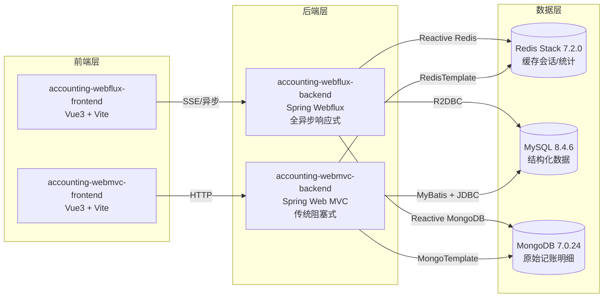

# 双栈记账系统 - 架构对比文档

## 一、项目总览

本项目是一个记账系统，提供了两套技术栈的后端实现（Webflux 响应式 & Web MVC 传统阻塞式）和两套对应的前端。两套后端共享同一套 MySQL、MongoDB 和 Redis 数据库，对外提供完全一致的 REST API 接口，前端可无缝切换对接。

### 模块结构

```
Spring-Weblux-Learn/
├── accounting-webflux-backend/   # Webflux 响应式后端（端口 8080）
├── accounting-webflux-frontend/  # 对应前端（端口 3000，代理 8080）
├── accounting-webmvc-backend/    # Web MVC 阻塞式后端（端口 8081）
├── accounting-webmvc-frontend/   # 对应前端（端口 3000，代理 8081）
└── docs/                         # 项目文档
```

### 整体架构图



## 二、技术栈对比

| 维度 | Webflux 版本 | Web MVC 版本 |
|------|-------------|--------------|
| **Web 框架** | Spring Webflux（响应式） | Spring Web MVC（Servlet 栈） |
| **线程模型** | Reactor Netty / 事件循环 | Tomcat / 线程池（每请求一线程） |
| **编程模型** | Mono/Flux 响应式流 | 同步阻塞方法调用 |
| **Spring Boot** | 3.5.16 | 3.5.16 |
| **安全框架** | Spring Security Reactive | Spring Security（Servlet） |
| **认证方式** | JWT（jjwt 0.12.5） | JWT（jjwt 0.12.5） |
| **MySQL 访问** | Spring Data R2DBC + r2dbc-mysql | MyBatis 3.0.x + MySQL Connector/J |
| **分页** | 手动 offset/limit + count | PageHelper 插件 |
| **Redis 访问** | Spring Data Redis Reactive（ReactiveRedisTemplate） | Spring Data Redis（RedisTemplate） |
| **MongoDB 访问** | Spring Data MongoDB Reactive（ReactiveMongoRepository） | Spring Data MongoDB（MongoRepository） |
| **构建工具** | Maven | Maven |
| **Java 版本** | 17 | 17 |
| **服务端口** | 8080 | 8081 |

## 三、核心架构差异

### 3.1 线程模型对比

#### Webflux（响应式）
- **事件循环模型**：少量线程（通常 = CPU 核心数）处理所有请求
- **非阻塞 I/O**：I/O 操作（数据库、Redis、MongoDB）通过异步驱动执行，不阻塞线程
- **背压支持**：Reactor 提供背压机制，防止下游过载
- **适用场景**：高并发 I/O 密集型、长连接（SSE/WebSocket）、流式数据

#### Web MVC（传统 Servlet）
- **线程池模型**：每请求分配一个线程，请求处理完毕后归还线程池
- **阻塞 I/O**：数据库等 I/O 操作会阻塞当前线程
- **同步编程**：代码顺序执行，调试简单直观
- **适用场景**：CPU 密集型、业务逻辑复杂、团队更熟悉同步编程

### 3.2 数据库访问层对比

| 特性 | Webflux (R2DBC) | Web MVC (MyBatis) |
|------|-----------------|-------------------|
| **驱动类型** | 异步非阻塞 R2DBC 驱动 | 同步阻塞 JDBC 驱动 |
| **返回类型** | Mono\<T\> / Flux\<T\> | T / List\<T\> |
| **ORM 方式** | Spring Data R2DBC Repository | MyBatis XML + 接口映射 |
| **事务管理** | @Transactional + R2dbcTransactionManager | @Transactional + DataSourceTransactionManager |
| **动态查询** | R2dbcEntityTemplate + Criteria | XML \<if\> 标签 / Provider |
| **分页实现** | 手动 offset + limit + count | PageHelper 自动分页 |
| **学习曲线** | 较高（响应式思维） | 较低（成熟生态） |

### 3.3 Redis 缓存对比

| 特性 | Webflux | Web MVC |
|------|---------|---------|
| **模板类** | ReactiveRedisTemplate | RedisTemplate |
| **返回类型** | Mono\<T\> | T |
| **连接方式** | Lettuce（异步） | Lettuce（同步） |
| **序列化** | Jackson2JsonRedisSerializer | Jackson2JsonRedisSerializer |
| **使用模式** | 链式 flatMap 操作 | 直接方法调用 |

### 3.4 MongoDB 访问对比

两套后端都使用 MongoDB 存储**原始记账记录明细**，存储结构完全一致：

| 特性 | Webflux | Web MVC |
|------|---------|---------|
| **Repository** | ReactiveMongoRepository | MongoRepository |
| **返回类型** | Mono\<T\> / Flux\<T\> | T / List\<T\> |
| **文档类** | BillDocument（@Document） | BillDocument（@Document） |
| **集合名** | bill_records | bill_records |
| **关联字段** | mysqlId（关联 MySQL bill.id） | mysqlId（关联 MySQL bill.id） |

### 3.5 账本功能对比

账本（Ledger）是本项目最核心的"多用户共享"业务，两套后端在数据访问、事务、并发处理上有明显差异：

| 维度 | WebMVC | Webflux |
|------|--------|---------|
| **数据访问** | MyBatis `LedgerMapper.xml`（XML SQL） | R2DBC `LedgerRepository`（接口方法命名查询） |
| **事务管理** | `@Transactional`（Spring 声明式） | 响应式链 `Transaction` + `TransactionalOperator` |
| **成员表** | `LedgerMemberMapper`（MyBatis） | `LedgerMemberRepository`（R2DBC） |
| **并发处理** | 同步阻塞，线程池调度 | Mono/Flux 链式，事件循环 |
| **异常传播** | 抛出即终止当前线程 | `Mono.error` / `Flux.error` 沿链下传 |

**示例：账本列表查询**

```java
// WebMVC：同步阻塞
public ApiResponse<List<Ledger>> listMyLedgers(Long userId) {
    List<Ledger> ledgers = ledgerMapper.selectByUserId(userId);
    return ApiResponse.ok(ledgers);
}

// Webflux：响应式链
public Mono<ApiResponse<List<Ledger>>> listMyLedgers(Long userId) {
    return ledgerRepository.findByOwnerIdOrMemberId(userId, userId)
            .collectList()
            .map(ApiResponse::ok);
}
```

### 3.6 allowMemberEdit 权限控制对比

`allowMemberEdit` 用于控制共享账本中普通成员是否可以互相编辑账单。该权限校验逻辑在 `BillService.updateBill()` 中实现：

| 维度 | WebMVC | Webflux |
|------|--------|---------|
| **方法签名** | `checkBillEditPermission(boolean)` | `checkBillEditPermission(Mono<Boolean>)` |
| **判断角色** | 直接读取 `Ledger.allowMemberEdit` | 链式 `.flatMap(ledger -> ...)` |
| **短路抛出** | `throw new BusinessException(...)` | `Mono.error(new BusinessException(...))` |
| **调用方式** | 普通 `if` 判断 | `flatMap` 串联，遵循响应式不阻塞原则 |

**核心差异**：WebMVC 走的是"同步判断 + 抛异常"路径；Webflux 必须用 `Mono.error` 让错误沿响应式链传递，否则会破坏非阻塞流。

### 3.7 JWT 公共提取对比

为消除两套后端的重复实现，JWT 核心逻辑下沉至 `accounting-common` 模块：

| 维度 | WebMVC | Webflux |
|------|--------|---------|
| **父类** | `accounting-common.security.JwtUtil` | `accounting-common.security.JwtUtil` |
| **方法重写** | 无（直接继承同步方法） | 无重写，新增 `Reactive` 后缀方法 |
| **核心方法** | `generateToken`、`extractUsername`、`validateToken`、`isTokenExpired` | 父类同名方法 + `generateTokenReactive`、`extractUsernameReactive`、`validateTokenReactive`、`isTokenExpiredReactive` |
| **包装方式** | 直接同步调用 | `Mono.fromCallable(...)` / `Mono.fromSupplier(...)` |
| **线程影响** | 阻塞当前 Servlet 线程 | 不阻塞 Reactor 事件循环线程（阻塞逻辑在 `Schedulers.boundedElastic` 中执行） |

**设计要点**：
- 公共模块只持有"不依赖响应式上下文"的纯函数式逻辑。
- Webflux 子类通过 `Mono.fromCallable` 将同步调用包装为 Mono，由 Reactor 自动调度。
- 两套后端共享同一份密钥（`jwt.secret`）与有效期（`jwt.expiration`）配置，行为完全一致。

### 3.8 Webflux 响应层重构对比

Webflux 中**没有** `ResponseBodyAdvice` 抽象，因此全局响应封装需用 WebFilter 方案：

| 维度 | WebMVC | Webflux |
|------|--------|---------|
| **实现机制** | `@ControllerAdvice` + `ResponseBodyAdvice<Object>` | `WebFilter` + `ServerHttpResponseDecorator` |
| **Controller 返回** | `ApiResponse<T>` | `Mono<T>`（不再返回 `Mono<ApiResponse<T>>`） |
| **拦截位置** | `beforeBodyWrite`（写入响应体前） | `WebFilter.filter`（响应写出前） |
| **序列化** | Spring MVC `HttpMessageConverter` | `ServerHttpResponse` 写入 `DataBuffer` |
| **异常处理** | `ResponseBodyAdvice` + `@ExceptionHandler` | `WebFilter` + `DataBuffer` 重写 |

**重构原因**：
- Spring Webflux 没有提供 `ResponseBodyAdvice` 等价物，无法在响应写出前以非侵入方式修改 body。
- WebFilter 是 Spring Webflux 唯一的"请求-响应"全局拦截点，能力等价于 Servlet 的 Filter。
- 通过 `ServerHttpResponseDecorator` 包装原始响应，延迟写入 `DataBuffer`，最终将业务返回的 `Mono<T>` 序列化为 `ApiResponse<T>` JSON。

**Controller 层效果**：

```java
// 重构前：Controller 自己包装
public Mono<ApiResponse<Bill>> getById(Long id) {
    return billService.getBill(id).map(ApiResponse::ok);
}

// 重构后：Controller 只返回业务数据
public Mono<Bill> getById(Long id) {
    return billService.getBill(id);
}
// 统一包装交给 ApiResponseWebFilter 完成
```

## 四、代码组织差异

### 4.1 包结构对比

**Webflux 后端**：
```
com.example.accounting/
├── common/          # 通用（ApiResponse、异常处理等，响应式返回）
├── config/          # 配置（CORS、WebFluxConfig 等）
├── controller/      # 控制器（返回 Mono<ApiResponse<T>>）
├── document/        # MongoDB 文档
├── dto/             # 数据传输对象
├── entity/          # R2DBC 实体（@Table）
├── repository/      # R2DBC Repository + ReactiveMongoRepository
├── security/        # 安全（ReactiveSecurityContext 等）
├── service/         # 服务层（全 Mono/Flux）
└── AccountingApplication.java
```

**Web MVC 后端**：
```
com.example.accounting/
├── common/          # 通用（ApiResponse、异常处理等，同步返回）
├── config/          # 配置（CORS、WebMvcConfig、拦截器等）
├── controller/      # 控制器（直接返回 ApiResponse<T>）
├── document/        # MongoDB 文档
├── dto/             # 数据传输对象
├── entity/          # 实体类（普通 POJO）
├── mapper/          # MyBatis Mapper 接口
├── repository/      # MongoDB Repository
├── security/        # 安全（SecurityContextHolder 等）
├── service/         # 服务层（同步方法）
└── AccountingWebmvcApplication.java
```

### 4.2 关键代码差异示例

**Controller 层**：

```java
// Webflux 版本
@GetMapping("/{id}")
public Mono<ApiResponse<Bill>> getById(@PathVariable Long id) {
    return billService.getBill(getCurrentUserId(), id);
}

// Web MVC 版本
@GetMapping("/{id}")
public ApiResponse<Bill> getById(@PathVariable Long id) {
    return billService.getBill(getCurrentUserId(), id);
}
```

**Service 层（数据库调用）**：

```java
// Webflux 版本 - 链式调用
public Mono<ApiResponse<Bill>> getBill(Long userId, Long billId) {
    return billRepository.findById(billId)
            .switchIfEmpty(Mono.error(new BusinessException("账单不存在")))
            .flatMap(bill -> {
                if (!userId.equals(bill.getUserId())) {
                    return Mono.error(new BusinessException("无权操作"));
                }
                return Mono.just(bill);
            })
            .map(ApiResponse::ok);
}

// Web MVC 版本 - 顺序执行
public ApiResponse<Bill> getBill(Long userId, Long billId) {
    Bill bill = billMapper.findById(billId);
    if (bill == null) {
        throw new BusinessException("账单不存在");
    }
    if (!userId.equals(bill.getUserId())) {
        throw new BusinessException("无权操作");
    }
    return ApiResponse.ok(bill);
}
```

**获取当前用户**：

```java
// Webflux 版本 - 从 ReactiveSecurityContext 获取
public Mono<Long> getCurrentUserId() {
    return ReactiveSecurityContextHolder.getContext()
            .map(ctx -> (UserDetails) ctx.getAuthentication().getPrincipal())
            .map(userDetails -> userRepository.findByUsername(userDetails.getUsername()))
            .flatMap(userMono -> userMono.map(User::getId));
}

// Web MVC 版本 - 从 SecurityContextHolder 获取
public Long getCurrentUserId() {
    Authentication auth = SecurityContextHolder.getContext().getAuthentication();
    UserDetails userDetails = (UserDetails) auth.getPrincipal();
    User user = userMapper.findByUsername(userDetails.getUsername());
    return user.getId();
}
```

## 五、API 一致性

两套后端的 **REST API 完全一致**，包括：
- 接口路径（`/api/auth/**`、`/api/bills`、`/api/categories`、`/api/statistics/**`）
- 请求参数
- 响应格式（`ApiResponse<T>`：code / message / data）
- 错误码约定

因此两套前端代码几乎完全相同，仅 Vite 代理的后端端口不同。

## 六、适用场景建议

### 选择 Webflux（响应式）的场景
- 高并发、高吞吐量需求（如 C10K+ 并发连接）
- I/O 密集型业务（大量数据库/缓存调用）
- 需要流式响应（SSE、Server Sent Events）
- 团队熟悉响应式编程，愿意承担学习成本
- 长连接场景（WebSocket、实时推送）

### 选择 Web MVC（传统）的场景
- 团队更熟悉同步编程模式
- 业务逻辑复杂，需要直观的代码调试
- CPU 密集型计算较多
- 对响应式编程经验不足，项目时间紧
- 需要大量第三方同步库，接入成本低

## 七、性能考量

| 指标 | Webflux 优势 | Web MVC 优势 |
|------|-------------|--------------|
| **高并发下的吞吐量** | ✅ 更高（线程复用，无阻塞） | ❌ 受线程池大小限制 |
| **内存占用** | ✅ 更低（线程数少） | ❌ 更高（线程栈内存） |
| **单请求延迟** | ❌ 略高（事件循环调度开销） | ✅ 更低（直接线程处理） |
| **CPU 密集型任务** | ❌ 无明显优势，可能更差 | ✅ 更直观高效 |
| **开发效率** | ❌ 较低（响应式学习曲线） | ✅ 较高（成熟生态） |
| **调试难度** | ❌ 较难（异步堆栈不直观） | ✅ 简单（同步调用栈清晰） |

> **注意**：具体性能表现因业务场景而异，建议通过压测对比选择。记账系统这类 CRUD 为主的应用，两者差异不大；但在极高并发下 Webflux 的资源利用率优势更明显。

## 八、账本功能的双栈实现差异对比

| 维度 | WebMVC | Webflux |
| --- | --- | --- |
| Controller 入口 | `LedgerController` 直接返回 `Ledger` | `LedgerController` 返回 `Mono<Ledger>` |
| 成员查询 | `LedgerMemberMapper.findByLedgerId` 同步 SQL | `LedgerMemberRepository.findByLedgerId` 返回 `Flux<LedgerMember>` |
| 共享账本邀请 | POST `/api/ledgers/{id}/members` 同步落库 | 同上，但 Service 层链式 `.flatMap` 校验+保存 |
| allowMemberEdit 校验 | `BillService.updateBill` 内 `if-else` 同步判断 | `.flatMap(allowed -> ...)` 链式判断 |

## 九、allowMemberEdit 字段的双栈实现

- **WebMVC**（`accounting-webmvc-backend/service/BillService.java`）：在 `updateBill` / `deleteBill` 入口通过 `if (userId.equals(bill.getUserId()))` 同步短路，然后 `ledgerMapper.findById` 拿 `allowMemberEdit` 判断。
- **Webflux**（`accounting-webflux-backend/service/BillService.java`）：把 `checkBillEditPermission` 抽成返回 `Mono<Boolean>` 的方法，链上 `.flatMap(allowed -> allowed ? save : Mono.error(...))`。
- 关键差异：Webflux 必须把"是否允许"这个判断结果也写成 `Mono<Boolean>`，因为整条链都是非阻塞的，不能有同步 if 短路后又回到响应式。

## 十、JWT 工具类公共提取的双栈差异

- **公共基类**：`accounting-common/security/JwtUtil.java` 提供 `generateToken` / `extractUsername` / `validateToken` 三个同步方法。
- **WebMVC 继承**：`accounting-webmvc-backend/security/JwtUtil.java extends accounting-common.JwtUtil` —— 直接复用同步方法。
- **Webflux 扩展**：`accounting-webflux-backend/security/JwtUtil.java extends accounting-common.JwtUtil` —— **新增** `*Reactive` 方法（`generateTokenReactive`、`extractUsernameReactive`、`validateTokenReactive`、`isTokenExpiredReactive`），用 `Mono.fromCallable(...)` 包装同步实现，避免在 Reactor 线程上执行阻塞 IO。
- 设计要点：基类保持同步 API 不变；Webflux 不去改基类签名（避免破坏 WebMVC），而是在子类加 Reactive 后缀的包装方法。

