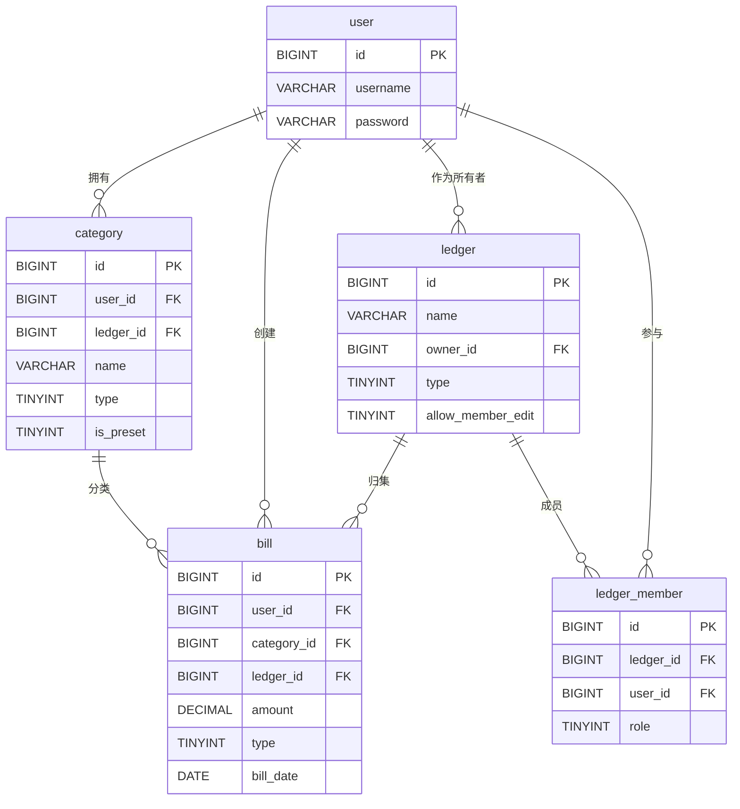

# MySQL 表设计说明

本文档从 ER 关系、字段约束、索引设计原则、命名规范四个维度对项目 MySQL 表进行说明，便于开发与维护时保持一致性。

## 1. ER 关系图

关系说明：

- `user` 1:N `category`：一个用户可创建多个自定义分类；同时存在 `user_id = 0` 的全局预设分类。
- `user` 1:N `ledger`：一个用户可作为所有者创建多个账本。
- `user` 1:N `ledger_member`：一个用户可参与多个账本（共享账本场景）。
- `user` 1:N `bill`：一个用户可创建多笔账单。
- `category` 1:N `bill`：一笔账单必须归属一个分类。
- `ledger` 1:N `bill`：账本对账单进行归集（`ledger_id` 可为 NULL，表示未归集）。
- `ledger` 1:N `ledger_member`：账本通过成员表与用户多对多关联。

## 2. 字段约束说明

| 表名            | 字段                | 约束类型        | 说明                                                                 |
|-----------------|---------------------|-----------------|----------------------------------------------------------------------|
| user            | id                  | 主键            | 自增 BIGINT，作为用户唯一标识                                        |
| user            | username            | UNIQUE NOT NULL | 用户名唯一且非空，是登录凭证之一                                     |
| user            | password            | NOT NULL        | BCrypt 加密后的密文，长度需预留                                      |
| category        | id                  | 主键            | 自增 BIGINT                                                           |
| category        | user_id             | DEFAULT 0       | 0 表示全局预设分类，便于在业务上区分"系统/用户"分类                  |
| category        | ledger_id           | NULL            | NULL 表示全局可见，便于同一分类在多个账本中复用                       |
| category        | (user_id, ledger_id, name, type) | UNIQUE 联合 | 同一用户/账本下不允许同名同类型的重复分类                              |
| category        | type                | TINYINT NOT NULL | 1-收入 2-支出，使用 TINYINT 节省空间                                  |
| category        | is_preset           | TINYINT DEFAULT 0 | 标记是否为预设分类，便于业务过滤                                       |
| ledger          | id                  | 主键            | 自增 BIGINT                                                           |
| ledger          | name                | NOT NULL        | 账本名称必填                                                          |
| ledger          | owner_id            | NOT NULL        | 创建者用户ID，不允许为空                                              |
| ledger          | type                | TINYINT NOT NULL DEFAULT 1 | 1-个人 2-共享                                       |
| ledger          | allow_member_edit   | TINYINT DEFAULT 1 | 控制共享账本中成员是否可编辑他人账单                                  |
| ledger_member   | id                  | 主键            | 自增 BIGINT                                                           |
| ledger_member   | (ledger_id, user_id) | UNIQUE 联合    | 同一用户在同一账本中只能有一条成员记录                                 |
| ledger_member   | role                | TINYINT NOT NULL DEFAULT 3 | 1-所有者 2-管理员 3-普通成员                          |
| bill            | id                  | 主键            | 自增 BIGINT                                                           |
| bill            | user_id             | NOT NULL        | 账单创建者，用于归属与权限控制                                         |
| bill            | category_id         | NOT NULL        | 必填分类 ID                                                          |
| bill            | amount              | DECIMAL(10,2) NOT NULL | 金额使用 DECIMAL 避免浮点精度问题                          |
| bill            | type                | TINYINT NOT NULL | 1-收入 2-支出                                                        |
| bill            | bill_date           | DATE NOT NULL    | 仅记录日期，便于按日/按月范围统计                                    |

## 3. 索引设计原则

1. **高频查询列加索引**：`user.username` 在登录场景被频繁按等值查询，因此建立唯一索引 `uk_username`；`bill.user_id` 在所有按用户过滤的查询中均会用到，配合 `bill_date` / `category_id` / `type` 形成多个复合索引。
2. **复合索引遵循最左前缀**：例如 `idx_user_date (user_id, bill_date)` 可同时覆盖 `WHERE user_id = ?` 与 `WHERE user_id = ? AND bill_date BETWEEN ? AND ?` 两类查询；`idx_user_category`、`idx_user_type` 同理。
3. **外键列加索引**：所有关联外键列（`bill.user_id` / `bill.category_id` / `bill.ledger_id` / `category.user_id` / `category.ledger_id` / `ledger.owner_id` / `ledger_member.ledger_id` / `ledger_member.user_id`）均建立索引，避免表关联与权限过滤时的全表扫描。
4. **业务唯一性用唯一索引**：通过 `uk_user_ledger_name_type` 保证同一用户/账本下分类不重名同类型；`uk_ledger_user` 保证同一用户不会重复加入同一账本；`uk_username` 保证用户名全局唯一。
5. **避免冗余与低选择度索引**：枚举型字段（如 `type`、`is_preset`）不单独建索引，而与 `user_id` 组合形成复合索引，以利用 `user_id` 的高选择度。

## 4. 命名规范

- **表名**：使用小写英文 + 下划线（snake_case），单数形式，例如 `user`、`bill`、`ledger_member`。
- **字段名**：使用小写英文 + 下划线（snake_case），例如 `user_id`、`bill_date`、`created_at`。
- **主键**：统一命名为 `id`，类型为 `BIGINT AUTO_INCREMENT`。
- **外键**：命名为 `{关联表单数}_id`，例如 `user_id`、`category_id`、`ledger_id`、`owner_id`。
- **时间字段**：统一以 `_at` 后缀命名，使用 `DATETIME` 类型，默认 `CURRENT_TIMESTAMP`；带 `ON UPDATE CURRENT_TIMESTAMP` 的字段命名为 `updated_at`。
- **布尔/枚举字段**：使用 `TINYINT(0/1)` 表示，并在字段注释中明确枚举值含义（如 `1-收入 2-支出`、`1-所有者 2-管理员 3-普通成员`）。
- **金额字段**：使用 `DECIMAL(10,2)`，避免浮点精度问题。
- **索引命名**：`idx_` 前缀 + 列名（多个列用下划线连接），例如 `idx_user_date`、`idx_ledger_id`；唯一索引使用 `uk_` 前缀，例如 `uk_username`、`uk_ledger_user`。
- **字符集与存储引擎**：所有表统一使用 `ENGINE=InnoDB DEFAULT CHARSET=utf8mb4`，确保事务支持与完整 UTF-8 字符集。
